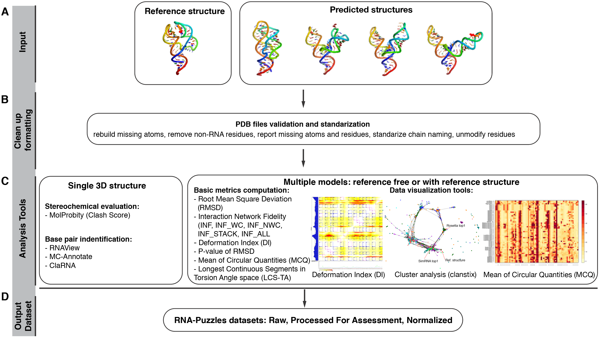

# RNA-Puzzles-toolkit-overview

**Figure 1.  Scheme of the RNA-Puzzles Toolkit.**
The Toolkit implements various tools for processing RNA structure files, and it is composed of three parts: tools for formatting and analyzing structural models. (A) The user can start an analysis with one or multiple models. (B) The first step is to standardize the formatting of analyzed structural models. (C) When the structures are standardized, the user can run an analysis for a single model, such as Clash Score evaluation or base pair identification using various methods. For multiple models, various comparison methods are implemented. The tools can be accessed via the command-line interface or Jupyter. The tools are provided as a Docker image that can be easily used. (D) Using the Toolkit, a normalized dataset of all submissions was generated and is available for download.

See you see examples of usages of the Toolkit with Jupyter: [See The RNA-Puzzles Tookit Overview](https://github.com/mmagnus/RNA-Puzzles-toolkit-overview/blob/master/rna-puzzle-toolkit.ipynb)